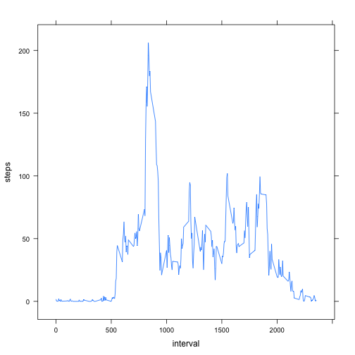

## Loading and preprocessing the data
  * Load the data (i.e. `read.csv()`)

```r
if (! file.exists("activity.csv")) {
  unzip("activity.zip")
}
activity <- read.csv("activity.csv")
```

* Process/transform the data (if necessary) into a format suitable for your analysis

```r
    stepsPerDay <- aggregate(steps ~ date, data = activity, sum, na.rm = TRUE)
```

## What is mean total number of steps taken per day?
 * Make a histogram of the total number of steps taken each day

```r
  hist(stepsPerDay$steps, xlab = "steps per day", ylab = "frequency (days)")
```

 

* Calculate and report the mean and median total number of steps taken per day

```r
meanStepsPerDay <- mean(stepsPerDay$steps)
meanStepsPerDay
```

```
## [1] 10766.19
```

```r
medianStepsPerDay <- median(stepsPerDay$steps)
medianStepsPerDay
```

```
## [1] 10765
```

## What is the average daily activity pattern?
 * Make a time series plot (i.e. `type = "l"`) of the 5-minute interval (x-axis) and the average number of steps taken, averaged across all days (y-axis)

```r
  library(lattice) 
  meanStepsAcrossInetervals <- aggregate(steps ~ interval, data = activity, mean, na.rm = TRUE)
  xyplot(steps~interval, type="l", data=meanStepsAcrossInetervals)
```

 

 * Which 5-minute interval, on average across all the days in the dataset, contains the maximum number of steps?

```r
  attach(meanStepsAcrossInetervals)
  maxAverageStepsAcrossInetervals <- max(steps)
  intervalWithHighestAvgVal<-interval[maxAverageStepsAcrossInetervals == steps][1]
  detach(meanStepsAcrossInetervals)
  intervalWithHighestAvgVal
```

```
## [1] 835
```

## Imputing missing values
 * Calculate and report the total number of missing values in the dataset (i.e. the total number of rows with `NA`s)

```r
  totalNuberOfRowsWithNa <- sum(!complete.cases(activity))
  totalNuberOfRowsWithNa
```

```
## [1] 2304
```
 * Create a new dataset that is equal to the original dataset but with the missing data filled in.

```r
  missingValues <- which(is.na(activity$steps))
  missingInterval <- data.frame(list(idx = missingValues, interval = activity$interval[missingValues]))
  subsitudes <- merge(missingInterval, meanStepsAcrossInetervals, by = "interval", all.x = TRUE)
  filledData <- activity
  filledData$steps[subsitudes$idx] <- subsitudes$steps
```

 * Make a histogram of the total number of steps taken each day and Calculate and report the **mean** and **median** total number of steps taken per day.

```r
  stepsPerDayFilled <- aggregate(steps ~ date, data = filledData, sum)
  hist(stepsPerDayFilled$steps, xlab = "steps per day", ylab = "frequency (days)")
```

 

```r
  meanStepsPerDayFilled <- mean(stepsPerDayFilled$steps)
  meanStepsPerDayFilled
```

```
## [1] 10766.19
```

```r
  medianStepsPerDayFilled <- median(stepsPerDayFilled$steps)
  medianStepsPerDayFilled
```

```
## [1] 10766.19
```
 
The median of total steps per day is slightly different

```r
  medianStepsPerDayFilled - medianStepsPerDay 
```

```
## [1] 1.188679
```
. Due to additional days available in the new data set (one filled with averages).

## Are there differences in activity patterns between weekdays and weekends?
 * Create a new factor variable in the dataset with two levels -- "weekday" and "weekend" indicating whether a given date is a weekday or weekend day.

```r
  filledDataWeekDays <- weekdays(as.Date(filledData$date))
  filledData$weekday <- factor(filledDataWeekDays == "Saturday" | filledDataWeekDays == "Sunday", 
                             levels = c(F, T), 
                             labels = c("weekday","weekend"))
```
 * Make a panel plot containing a time series plot (i.e. `type = "l"`) of the 5-minute interval (x-axis) 

```r
  library(lattice)
  meanStepsAcrossInetervalsWk <- aggregate(steps ~ interval + weekday, 
                                           data = filledData, mean, na.rm = TRUE)
  trellis.par.set(mfrow=c(2,2))
  xyplot(steps~interval | weekday, type="l", 
         data=meanStepsAcrossInetervalsWk, col=c("blue","blue"))
```

 
